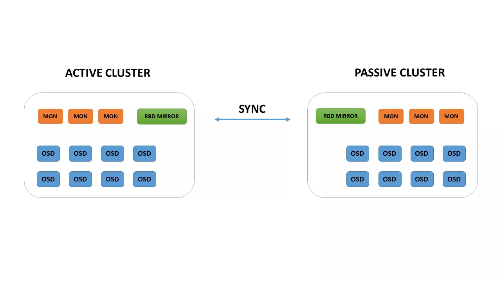

# RBD Mirror 

Có 2 mode chính có thể sử dụng 

- pool: When configured in pool mode, all images in the pool with the journaling feature enabled are mirrored.

- image: When configured in image mode, mirroring needs to be explicitly enabled on each image.

# Phương án 1: RBD Mirror pool 

- Một cách đồng bộ không realtime từ Cluster chính sang cluster phụ 
- Đối với việc cấu hình mirror theo pool, toàn bộ images có feature `journaling` sẽ được mirror

## Mục tiêu bài lab 
Giả định rằng có hai cụm, một cụm được gọi là Ceph chứa images được sử dụng trong prod và cụm Cephbackup tại đó images được kéo về từ cluster sao lưu để khôi phục sau thảm họa. 
Ý tưởng chung là một hoặc nhiều rbd-mirror trên cụm cephbackup sẽ kéo backup các images từ cụm Ceph 

Nếu sử dụng đồng bộ 2 chiều cần cấu hình ngược lại 

## Các bước thực hiện 
- Cấu hình pool enable mirror 
- Tạo images và add thêm feature để có thể mirror
- Cài đặt rbd-mirror trên node backup Cluster 
- Cấu hình cả 2 cluster bằng cách add user connect vào cluster 
- Cấu hình mirror từ Cluster chính bằng cách thiết lập kết nối qua key 
- Start rbd-mirror 

## Các yêu cầu cơ bản 
- Mô hình 2 node CephAIO 



- 2 cụm có 2 cluster name khác nhau 
    + Cluster Active 10.0.12.51,52,53 --cluster=ceph
    + Cluster Passive 10.0.12.55,56,57 --cluster=cephbackup 

- Network giữa 2 cụm phải đảm bảo bandwidth cho việc kết nối đồng bộ rbd-mirror

- Cephdeploy 2.0.1 không deploy được cụm có clustername khác ceph => deploy bằng ceph-ansible 


## Chuẩn bị trên cả 2 cụm 

Tạo pool
```sh 
ceph osd pool create rbd 256
ceph osd pool set rbd size 2
```

Enable mirror mode 
```sh 
rbd mirror pool enable rbd pool
```

Tạo alias để thao tác trên cụm Ceph
```sh 
echo """
alias ceph='ceph --cluster ceph'
alias rbd='rbd --cluster ceph'
""" >> /root/.bashrc
source /root/.bashrc
```

Tạo alias để thao tác trên cụm Cephbackup
```sh 
echo """
alias ceph='ceph --cluster cephbackup'
alias rbd='rbd --cluster cephbackup'
""" >> /root/.bashrc
source /root/.bashrc
```

## Tạo images để test mirror trên cụm Ceph

Tạo images 
```sh 
rbd create rbd/images --size 4G
```

Enable feature 
```sh 
rbd feature enable rbd/images journaling
```

Kiểm tra feature 
```sh 
rbd info rbd/images
```


## Tạo user trên cụm Ceph
```sh 
ceph auth get-or-create client.rbd-mirror.master mon 'profile rbd' osd 'profile rbd pool=rbd' -o /ceph-deploy/ceph.client.rbd-mirror.master.keyring
cp /ceph-deploy/ceph.client.rbd-mirror.master.keyring /etc/ceph/ceph.client.rbd-mirror.master.keyring
```

## Tạo user trên cụm CephBackup 
```sh
ceph auth get-or-create client.rbd-mirror.cephbackup mon 'profile rbd' osd 'profile rbd pool=rbd' -o /etc/ceph/cephbackup.client.rbd-mirror.backup.keyring
```

## Copy config và key của cụm Ceph sang node cụm CephBackup 
> Yêu cầu node 

```sh 
scp /etc/ceph/ceph.conf root@10.0.12.55:/etc/ceph/
scp /etc/ceph/ceph.client.rbd-mirror.master.keyring root@10.0.12.55:/etc/ceph/
```

## Start rbd-mirror daemon trên node cụm CephBackup 
Cài đặt `rbd-mirror`
```sh
yum install rbd-mirror -y 
```

```sh
systemctl enable ceph-rbd-mirror.target
cp /lib/systemd/system/ceph-rbd-mirror@.service /etc/systemd/system/ceph-rbd-mirror@.service
sed -i -e 's/setuser ceph.*/setuser root --setgroup root/' /etc/systemd/system/ceph-rbd-mirror@.service
systemctl enable ceph-rbd-mirror@.service
systemctl start ceph-rbd-mirror@.service
```

## Add peer trên node cụm Ceph Backup 
```sh
rbd mirror pool peer add rbd client.rbd-mirror.master@cephbackup
```

## Kiểm tra 

```sh 
rbd mirror pool info rbd
rbd mirror pool status rbd --verbose
```


## Tài liệu tham khảo 
- https://pve.proxmox.com/wiki/Ceph_RBD_Mirroring
- https://access.redhat.com/documentation/en-us/red_hat_ceph_storage/3/html/block_device_guide/block_device_mirroring
- https://docs.ceph.com/docs/nautilus/rbd/rbd-mirroring/